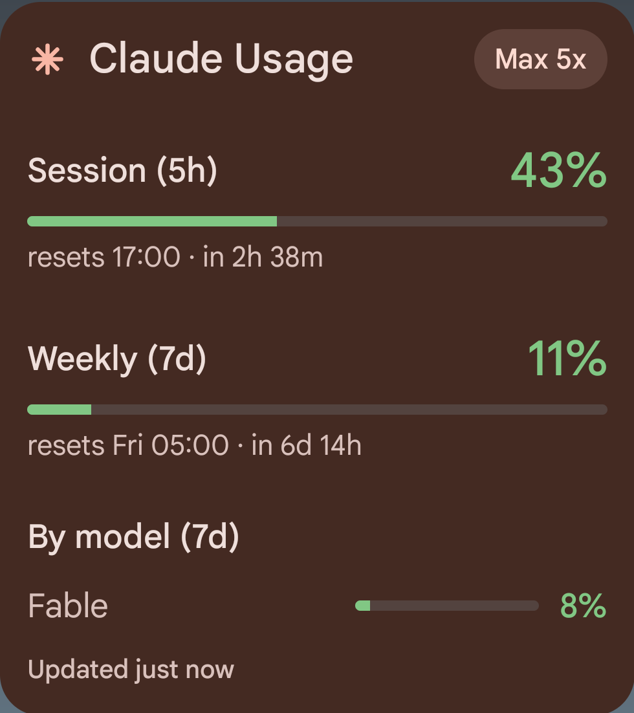
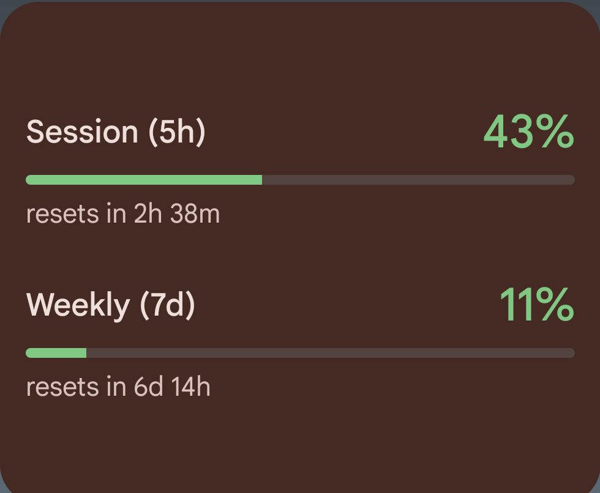
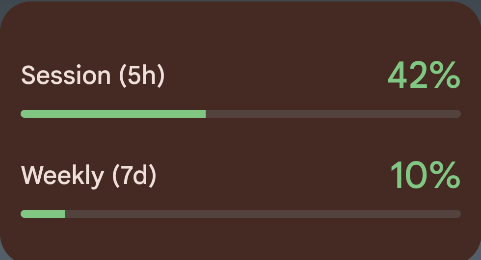
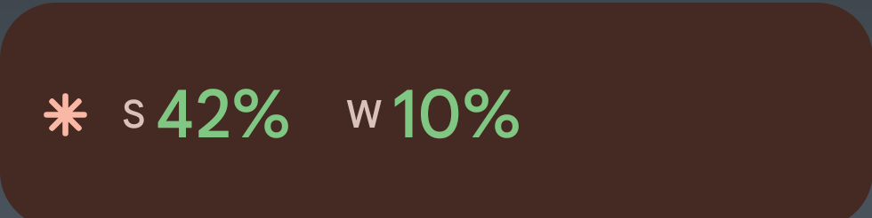
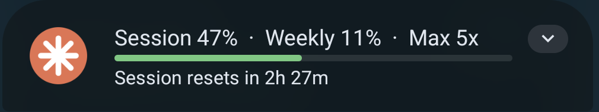
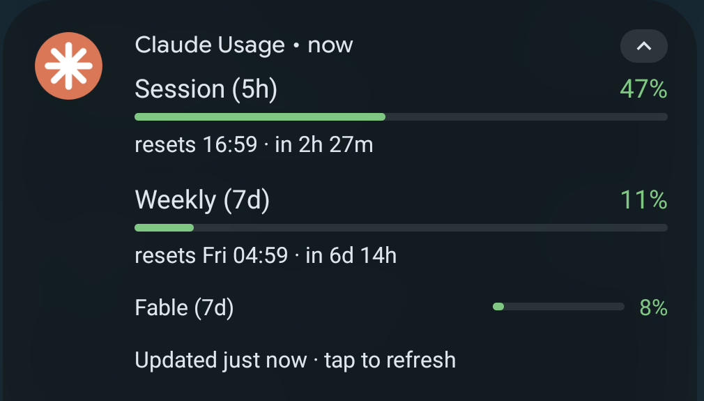
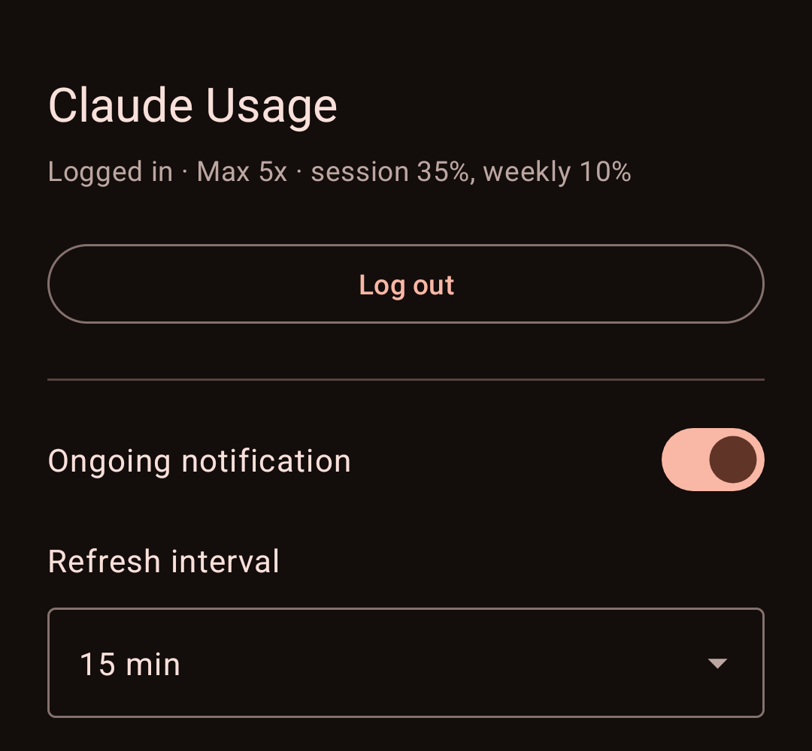

# Claude Usage (Android)

Your Claude subscription usage on the home screen and in the status bar.
An Android port of the ideas in
[plasma-claude-usage](https://github.com/gdevenyi/plasma-claude-usage).

- **Home-screen widget** — session (5h) and weekly (7d) percentages, colour
  coded, with progress bars, reset countdowns and the per-model breakdown.
  It scales with the size you give it, from a 2×1 chip to a full panel.
- **Ongoing notification** — the same numbers in the shade; expand for the
  full breakdown.
- Tap either one to refresh immediately. Otherwise it updates every 15
  minutes in the background.

## Screenshots

The widget shows everything at four rows — both windows with reset times, the
per-model breakdown and your plan:



Give it less room and it drops content rather than clipping it: the reset
times go first, then the labels.





The notification carries the same numbers, collapsed and expanded:




The app itself is only settings:



## Requirements

Android 13 or later, and a Claude subscription (Pro or Max).

## Install

No release yet. Build and sideload:

```bash
./gradlew :app:assembleDebug
adb install -r app/build/outputs/apk/debug/app-debug.apk
```

You need the Android SDK; point `local.properties` at it with
`sdk.dir=/path/to/Android/Sdk`.

## Logging in

Open the app and tap **Log in with Claude**. Your browser opens Claude's
authorization page; approve it, copy the code it shows you, and paste it back
into the app.

The app logs in on its own and holds its own credentials. It does not read,
copy or need the credentials from Claude Code on your computer — and logging
in here does not disturb any of your other Claude Code sessions.

## How it works

The app performs the OAuth PKCE flow that Claude Code uses, then polls
`https://api.anthropic.com/api/oauth/usage` with its own access token,
refreshing that token itself as needed. Nothing is sent anywhere else, and
the tokens stay in the app's private storage.

This uses an OAuth flow that Anthropic has not documented for third parties.
It works today; it could stop working if Anthropic changes it.

## Settings

Log in / log out, turn the ongoing notification on or off, and choose the
refresh interval (15, 30 or 60 minutes — 15 is the shortest Android's
background scheduler allows).

## License

GPL-3.0-or-later.
